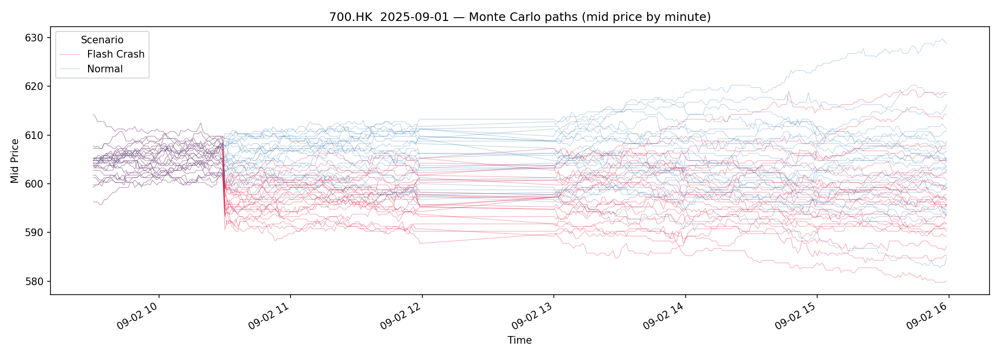

# Pulse — Synthetic Market Data by Simudyne

**Pulse** is Simudyne's agent-based market simulator. It generates synthetic tick-level order book data for financial instruments. These are calibrated to real historical microstructure and delivered via a Python SDK and REST API. Use it to test execution algorithms, stress-test strategies, and build training data for market models.

> **Get started free:** [Sign Up](https://pulse.simudyne.com) · [API Docs](https://pulse.simudyne.com/docs) · [API Console](https://pulse-app.simudyne.com)

---

## What the API Does

### Browse and download pre-run simulations
The free tier gives immediate access to a library of cached simulations across HKEX symbols. No job submission needed, just browse, pick a symbol, and download full L2 LOB data and tick data.

```python
from simudyne import PulseABM

client = PulseABM(api_key="pk_live_...")

sims = client.simulation.list_cached()
df   = client.simulation.get_sim_data(sim_id="...", filename="sim_data.parquet")
```

Each simulation returns full **millisecond-resolution L2 order book data** (10 levels each side) plus an order-by-order event stream as a Polars DataFrame.

---

### Run custom simulation jobs

Submit a job against any symbol, calibration date, and market scenario. Pulse runs up to 100 Monte Carlo realisations in parallel, giving you an empirical distribution of outcomes rather than a single path.

```python
job = client.simulation.run(
    symbol="700.HK",
    cal_date="2025-09-01",
    n_runs=100,
    scenario="flash_crash",
    exec_algos=["TWAP", "VWAP"]
)
status  = client.simulation.get_job_status(job.job_id)
results = client.simulation.get_job_results(job.job_id)
```



**Available scenarios:**

| Scenario | What it injects |
|---|---|
| `normal` | No directional shock — background agents only |
| `flash_crash` | Large rapid SELL (22× order size, 500 ms intervals) |
| `buy_panic` | Large rapid BUY (22× order size, 500 ms intervals) |
| `gradual_selloff` | Sustained SELL pressure (10×, 5 s intervals) |
| `trending_up` | Slow steady BUY drift (5×, 30 s intervals) |
| `trending_down` | Slow steady SELL drift (5×, 30 s intervals) |

---

### Test execution algorithms under stress

Include TWAP, VWAP, or a Custom Static Schedule (CSS) in any simulation job. Pulse runs the algo inside the simulated order book and returns implementation shortfall, fill rate, and market impact metrics alongside the tick data.

```python
job = client.simulation.run(
    symbol="9988.HK",
    cal_date="2025-09-01",
    scenario="gradual_selloff",
    exec_algos=["TWAP", "VWAP", "CSS"]
)
```

Output files per simulation:

| File | Contents |
|---|---|
| `sim_data.parquet` | Full L2 book + order events at tick resolution |
| `mid_price_by_min.parquet` | Mid-price in 1-minute bars |
| `l2_by_second.parquet` | L2 snapshot (10 levels) sampled per second |
| `exec_results.parquet` | Slippage, fill rate, and market impact per algo |
| `exec_schedule.parquet` | Order schedule with times and quantities |
| `results.json` | Job-level summary metrics |

---

### Bulk download across multiple simulations

```python
dfs = client.simulation.get_bulk_data(
    sim_ids=[...],
    include_sim_data=True,
    include_mid_price=True
)
```

Returns a ZIP of parquet files. This is useful for building datasets across many symbols, dates, or scenarios in one call.

---

## How We Validate the Data

Synthetic data is only useful if it is realistic. Pulse is validated against historical microstructure using a suite of established academic benchmarks, the same methods used to evaluate leading market simulators in recent literature.

| Benchmark | What It Checks |
|---|---|
| Cont (2001) Stylised Facts | 11 statistical properties that all real markets exhibit |
| LOB-Bench | Distributional accuracy across 16 order book metrics |
| Bouchaud Impact Response | Price impact of individual order events across lag horizons |

---

## What You Can Build With It

- **Algo benchmarking** — compare TWAP vs VWAP slippage across symbols and stress regimes without live market exposure
- **Stress testing** — run the same strategy across all six scenarios and 100 Monte Carlo paths to get tail-risk estimates
- **Training data** — generate large volumes of realistic synthetic order flow for reinforcement learning agents or market impact models
- **Pre-trade TCA** — estimate expected execution costs for a given order size before placing it in the real market
- **Liquidity research** — study how spread, depth, and order imbalance evolve under different shock types across the HKEX universe

---

## Tiers

| | Free | Pro |
|---|---|---|
| Cached simulations | ✓ | ✓ |
| Tick-level L2 download | ✓ | ✓ |
| Custom calibration dates | — | ✓ |
| All 6 pre-built scenarios | — | ✓ |
| Up to 100 Monte Carlo runs | — | ✓ |
| Execution algo testing | — | ✓ |

**Start free — no credit card required:** [pulse.simudyne.com](https://pulse.simudyne.com)  

---